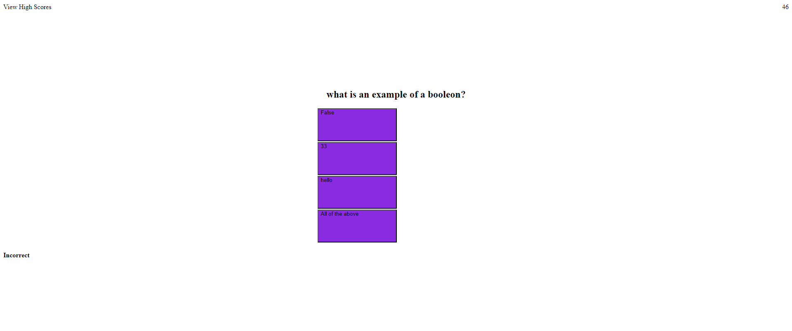

# quizwebapi

## Description
I am building a quiz website mostly using javascript that has a timer and keeps track of your score. it also allows you to save your score in local storage.
I learned more about getting classes and ids as when you get class by name it creates an array when theres more. also local sorage how to set and get items.

## usage

## Features 
this project features a timer different answers to press a score that changes if you get them wrong or right and a way to save your score.